# MembershipFlow

골프 회원권 시세 추적 SaaS. 실운영 중 → **[membershipflow.site](https://membershipflow.site)**

회원권 거래소 여덟 곳의 시세를 매일 자동 수집해 차트로 보여주고, 목표가에 닿으면 WebSocket으로 알린다. 스키마 설계부터 배치·결제 연동·배포·장애 대응까지 1인이 맡아 2026년 5월부터 공개 운영 중이다.

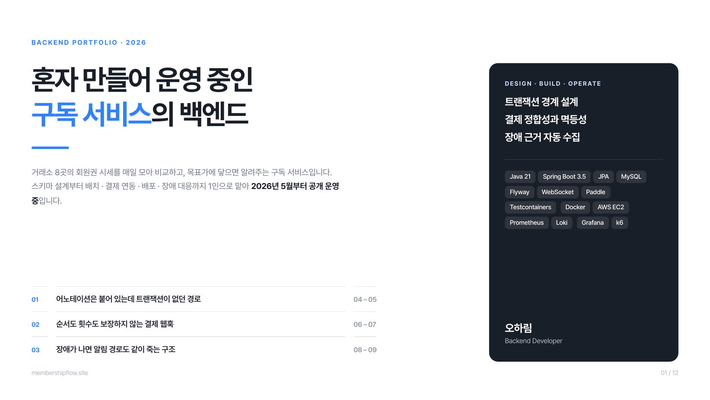

---

## 한눈에

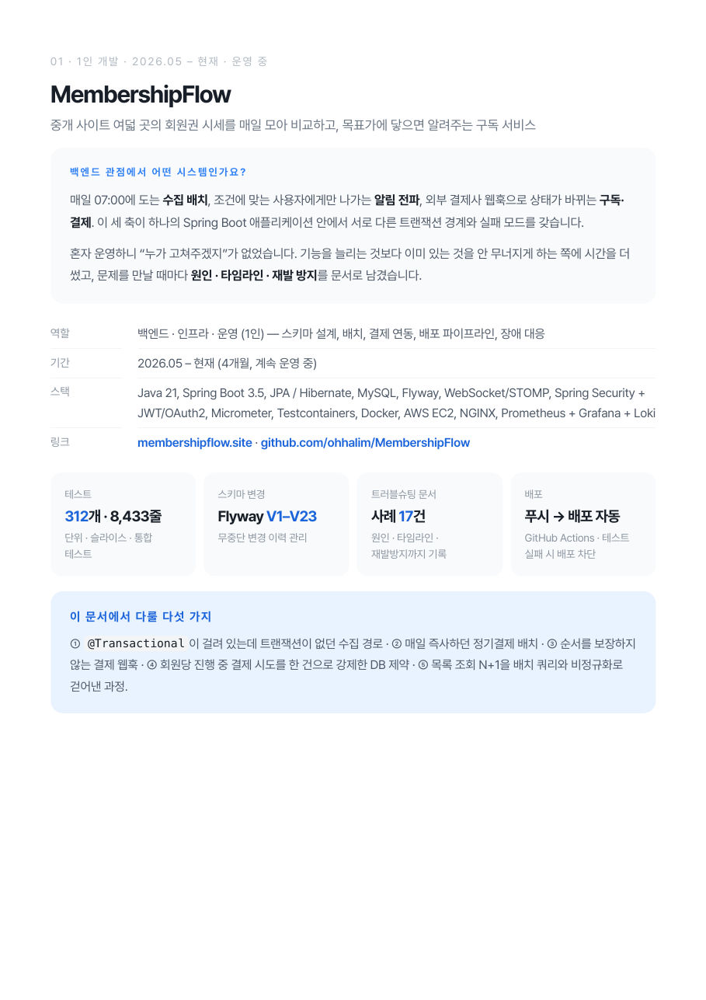

| | |
|---|---|
| 역할 | 백엔드 · 인프라 · 운영 (1인) |
| 기간 | 2026.05 – 현재 |
| 테스트 | 312개 · 8,433줄 (단위 · 슬라이스 · Testcontainers 통합) |
| 스키마 | Flyway V1–V23 |
| 기록 | [트러블슈팅 17건](docs/TROUBLESHOOTING.md) |

**스택**

Spring Boot 3.5 · Java 21 · MySQL · JPA/Hibernate · Flyway · Spring WebSocket/STOMP  
Spring Security + JWT/OAuth2 · Jsoup · TossPayments · Paddle · Micrometer · Testcontainers  
Next.js 14 · TypeScript · Tailwind CSS · SWR  
Docker Compose · GitHub Actions · nginx · Prometheus · Grafana · Loki · Grafana Alloy · AWS EC2

---

## 시스템

매일 도는 수집 배치, 조건에 맞는 사용자에게만 나가는 알림 전파, 외부 결제사 웹훅으로 상태가 바뀌는 구독·결제. 세 축이 하나의 애플리케이션 안에 있지만 **트랜잭션 경계와 실패 모드가 서로 다르다.**

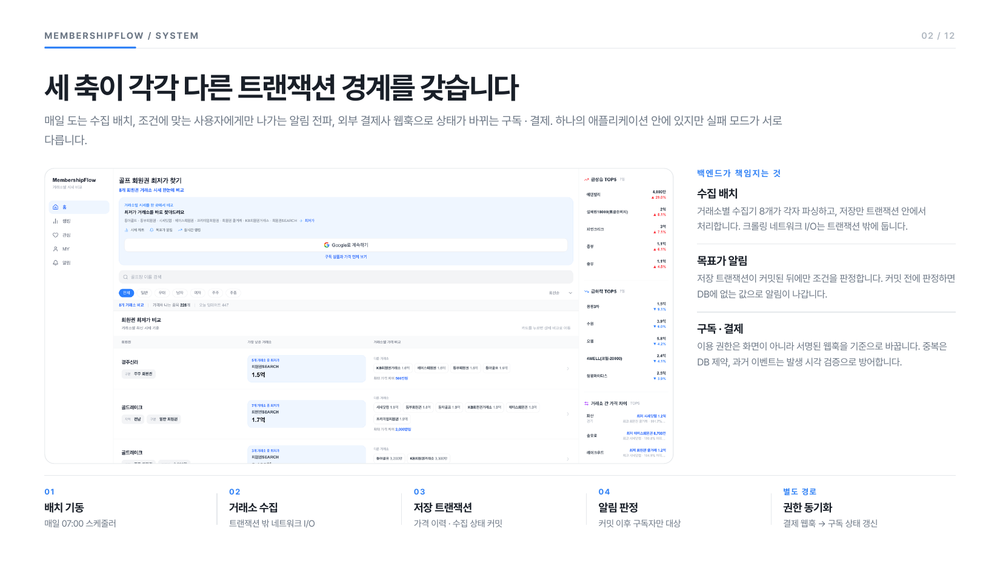

## 아키텍처

앱 서버가 통째로 멈춘 장애를 겪고 나서, 감시하는 쪽이 감시당하는 쪽과 같이 죽으면 안 된다고 판단해 관측 스택을 별도 서버로 옮겼다.

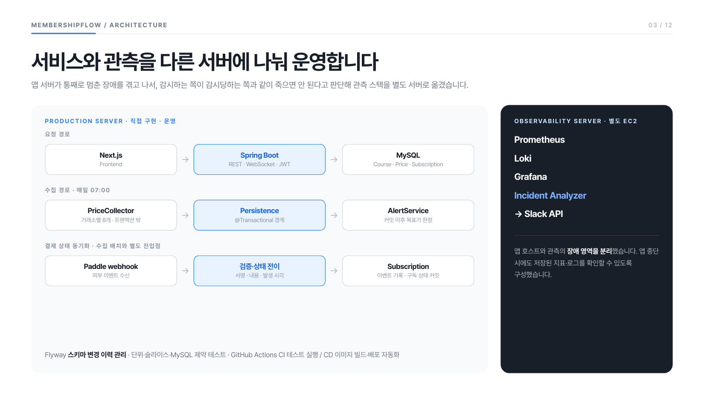

---

## 마주친 문제와 해결

### 01 · 어노테이션은 붙어 있는데 트랜잭션이 없었다

시세 저장은 정상인데 목표가 알림이 한 번도 발동하지 않았다. 알림 코드에도 스케줄러에도 에러가 없었다.

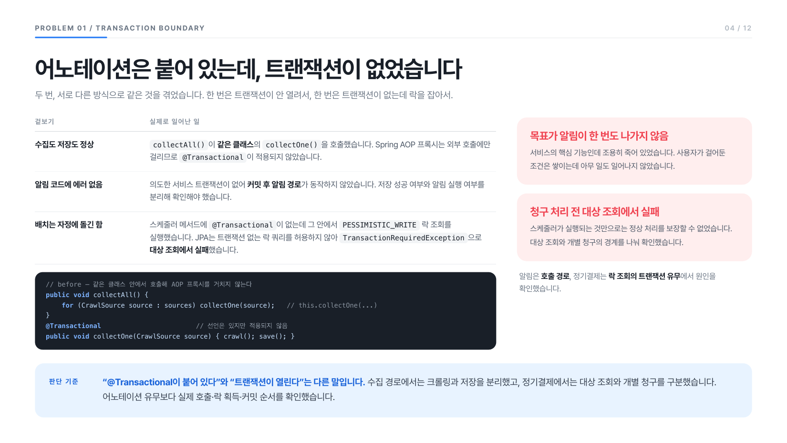

어노테이션을 옮기는 것으로는 부족했다. 크롤링은 외부 사이트 여덟 곳을 도는 네트워크 I/O이고, 이것까지 트랜잭션에 들어가면 DB 커넥션을 수십 초씩 붙잡는다.

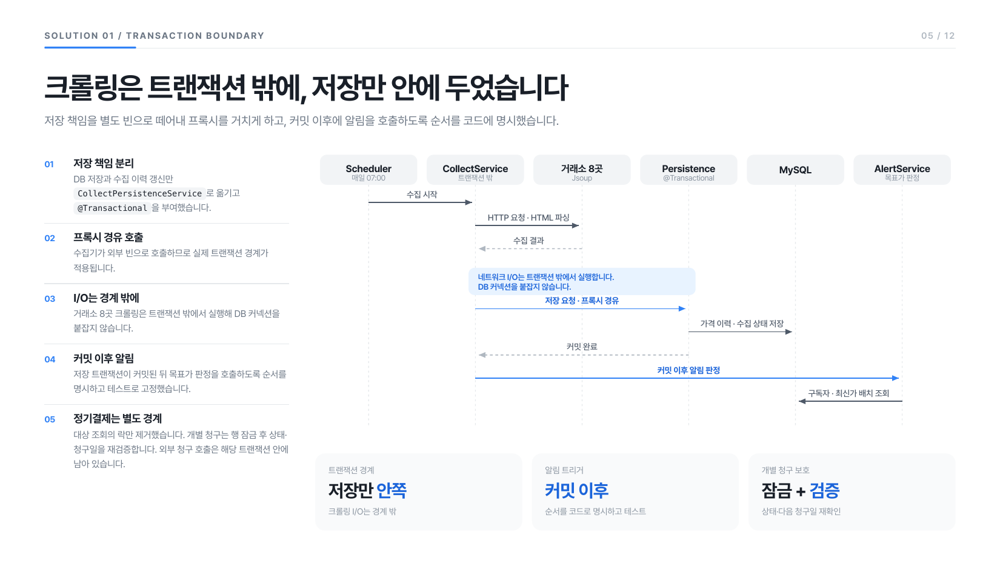

<details>
<summary>같은 종류의 문제가 정기결제 배치에도 있었다</summary>

스케줄러 메서드에 `@Transactional`이 없는데 그 안에서 `PESSIMISTIC_WRITE` 락 조회를 실행하고 있었다. JPA는 트랜잭션 없는 락 쿼리를 허용하지 않으므로 `TransactionRequiredException`으로 매 실행 즉시 끊겼다.

배치 전체를 하나의 트랜잭션으로 감싸면 실행이 끝날 때까지 커넥션과 락을 붙잡는다. 외부 결제사 호출이 그 안에 들어가면 외부 지연이 그대로 DB 점유 시간이 된다. 락을 그냥 빼면 조회 시점과 결제 시점 사이에 취소된 구독을 과금할 수 있다.

락 조회를 일반 조회로 바꾸고, 락이 하던 보호는 **결제 직전 재검증 가드**로 옮겼다. 실제 청구 트랜잭션 안에서 구독 상태와 다음 청구일을 다시 확인해, 조회 이후 취소·변경된 구독은 과금하지 않고 넘어간다. 같은 배치가 두 번 돌아도 결과가 같다.

→ [`CollectPersistenceService`](src/main/java/com/membershipflow/collect/service/CollectPersistenceService.java)

</details>

### 02 · 결제는 끝났는데 구독은 아직 아니다

사용자는 카드 결제 성공 화면을 먼저 본다. 하지만 이용 권한이 실제로 열리는 건 서명된 웹훅을 검증하고 내부 트랜잭션이 끝난 뒤다. 이 사이에 틈이 있다.

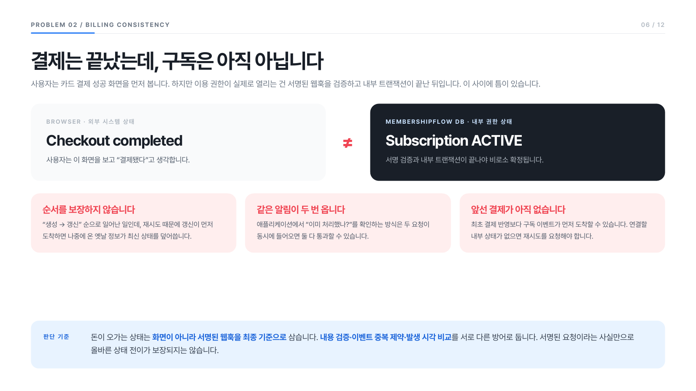

정기결제가 별도 심사와 심사비를 요구해 혼자 만든 서비스로는 넘기 어려운 문턱이었다. 결제 코드를 갈아엎는 대신 `payment_provider` 컬럼과 결제사별 외부 식별자를 분리해 **기존 Toss 경로를 지우지 않고** Paddle 경로를 나란히 추가했다.

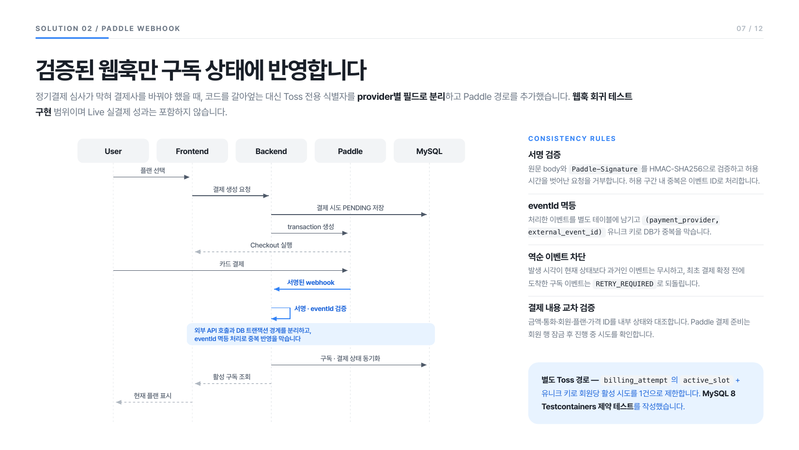

- **역순**은 도메인에서 막았다. 이벤트 발생 시각(`occurred_at`)이 현재 저장된 외부 갱신 시각보다 과거면 무시한다 → [`Subscription#isStaleExternalEvent`](src/main/java/com/membershipflow/subscription/entity/Subscription.java)
- **중복**은 애플리케이션 체크로는 동시 요청에서 뚫린다고 보고 DB에 맡겼다. `(payment_provider, external_event_id)` 유니크 키를 걸었다. 코드는 뚫려도 유니크 키는 뚫리지 않는다 → [V23](src/main/resources/db/migration/V23__add_paddle_payment_provider.sql)

> Paddle **Sandbox**에서 구독 결제 E2E와 웹훅 회귀 테스트를 통과했다. **Live 키 전환과 실결제 운영은 아직 범위 밖이다.**

<details>
<summary>"회원당 진행 중 결제 시도는 한 건"을 코드가 아니라 스키마로 강제했다</summary>

결제 준비 요청이 동시에 들어오면 같은 회원에게 진행 중인 시도가 여러 건 생긴다. 여기서 갈라지면 이중 청구나 고아 결제로 이어진다. MySQL에는 부분 유니크 인덱스가 없어 "상태가 PENDING/PROCESSING인 행만 유일" 같은 제약을 직접 걸 수 없다.

상태에서 파생되는 생성 컬럼을 만들었다. `active_slot`은 상태가 진행 중일 때만 `1`이고 그 외에는 `NULL`이다. 여기에 `UNIQUE (member_id, active_slot)`을 걸면 NULL은 유니크 제약에 참여하지 않으므로 **완료·실패 이력은 얼마든지 쌓이면서 진행 중인 행만 회원당 한 건**으로 강제된다.

이 동작은 JPA나 H2로는 확인되지 않아 Testcontainers로 실제 MySQL 8을 띄워 검증했다. 진행 중 행이 있을 때 두 번째 INSERT가 실패하고, 앞의 행을 완료로 바꾸면 다시 INSERT가 되는지를 테스트로 고정했다.

→ [V18](src/main/resources/db/migration/V18__initial_payment_processing_guard.sql)

</details>

### 03 · 장애가 나면 알려줄 경로도 같이 죽는다

운영 EC2(t3.small)가 응답 불능이 됐다. API · WebSocket · SSH · `docker ps`가 동시에 타임아웃됐는데 AWS 상태 검사는 전부 통과였고 애플리케이션 로그에는 아무 에러도 없었다.

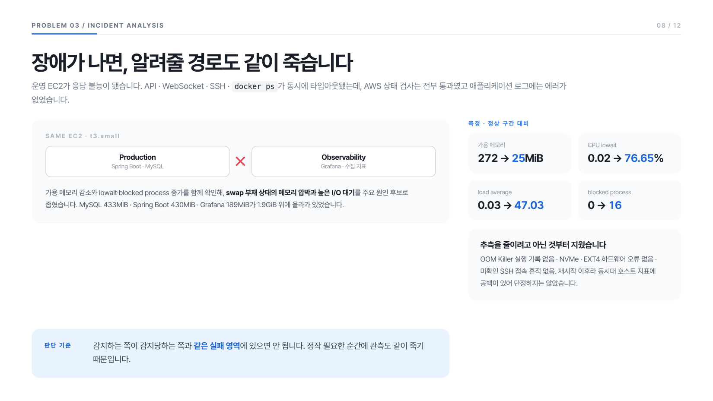

추측을 줄이려고 아닌 것부터 지웠다. OOM Killer 실행 기록 없음, 하드웨어 오류 없음, 미확인 접속 흔적 없음. MySQL 433MiB · Spring Boot 430MiB · Grafana 189MiB가 1.9GiB 위에 올라가 있고 **swap이 없어 완충 구간이 전혀 없었다.** 메모리 압박과 높은 디스크 I/O 대기를 주요 원인 후보로 좁혔다. 재시작 이후라 동시대 지표에 공백이 있어 **단정하지는 않았다.**

swap을 붙이고 호스트 메모리·iowait를 Prometheus 수집 대상에 추가한 뒤, 관측 스택을 별도 서버로 분리했다. 이 판단이 별도 프로젝트로 이어졌다.

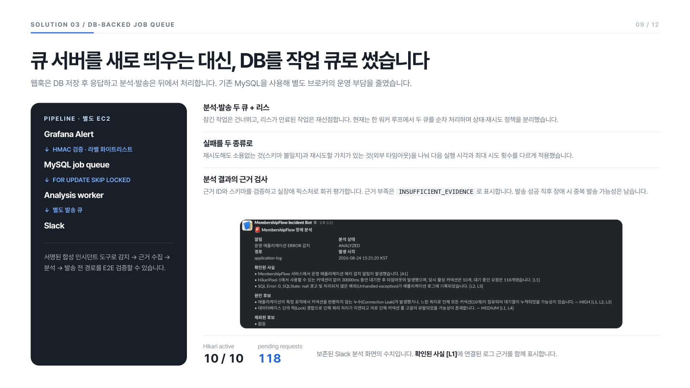

→ [MembershipFlow-observability](https://github.com/ohhalim/MembershipFlow-observability)

### 04 · 목록 한 번 여는 데 쿼리가 종목 수만큼 나갔다

같은 회원권의 "현재가"는 거래소별 최신 행 중 최저가다. 목록에서 종목마다 이걸 구하면 종목 수만큼 쿼리가 나가고, 정렬·랭킹·요약까지 각자 같은 계산을 반복했다.

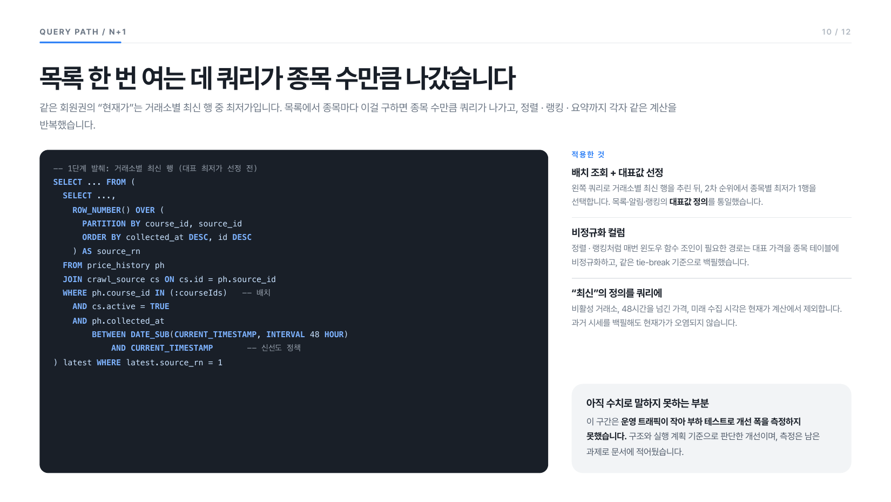

"최신"의 정의도 코드가 아니라 쿼리에 박았다. 비활성 거래소, 48시간을 넘긴 가격, 미래 수집 시각은 현재가 계산에서 제외한다. 과거 시세를 백필할 때 미래 시각이 섞여도 현재가가 오염되지 않는다.

→ [V13](src/main/resources/db/migration/V13__add_latest_price_columns.sql) · [V19](src/main/resources/db/migration/V19__price_freshness_indexes.sql)

> 이 구간은 **운영 트래픽이 작아 부하 테스트로 개선 폭을 측정하지 못했다.** 구조와 실행 계획 기준으로 판단한 개선이고, 측정은 남은 과제다.

---

## 그 밖의 구현

<details>
<summary>시세 수집 — 여덟 소스의 개별 문제</summary>

Jsoup으로 여덟 소스를 크롤링한다. 프리미엄회원권·회원권 쿨거래·KB회원권거래소·회원권SEARCH는 기존 종목과 정확히 매칭되는 시세만 저장해 단일 출처 신규 종목 증가를 방지한다.

동아회원권은 Java 21이 기본 차단하는 구형 DH 키 사이즈를 쓴다. JVM 전체 보안 정책을 푸는 대신 `@PostConstruct`에서 해당 항목만 런타임 제거해 최소 범위로 처리했다.

Jsoup HTML 파싱 시 `&amp;` → `&` 디코딩 탓에 regex URL 추출이 0건이었다. `select("a[href*=...]").attr("href")` 방식으로 전환해 해결했다.

1년치 히스토리 수집은 수십 초가 걸려 nginx 504가 났다. `@Async` + 즉시 202 반환으로 분리했다. CoinFlow에서 쓴 HTTP 응답 분리 패턴을 다시 적용한 것이다.

</details>

<details>
<summary>구독 · 알림 · CI/CD</summary>

**구독** — TossPayments 빌링키 방식이 원래 경로다. 카드 1회 등록 후 월간·연간 주기로 자동결제하고, `BillingScheduler`가 매일 자정 만료 구독을 재청구한다. 연속 3회 실패 시 `SUSPENDED`. 빌링키는 AES-256으로 암호화해 저장한다.

구독 상태에 따라 차트 기간(비구독자 7일 clamp)과 관심 종목 한도(비구독자 3개)를 게이팅한다.

**알림** — 수집 완료 후 `afterCommit()` 트리거. 커밋 전에 알림을 보내면 DB에 없는 값 기준으로 알림이 나간다. STOMP `/user/queue/alert`로 push하고 `alert_log`로 24시간 중복을 막는다.

**CI/CD** — main push → 테스트 통과 → Docker 이미지 빌드 → scp로 nginx·Docker Compose·Alloy 설정 EC2 자동 복사 → 백엔드 health gate와 telemetry 상태 검증. 수동 SSH 없이 코드 변경이 즉시 반영된다.

</details>

<details>
<summary>모니터링 구성</summary>

Application EC2의 node-exporter·mysqld-exporter가 호스트와 MySQL 메트릭을 노출하고, Alloy가 백엔드 JSON 로그와 MySQL lock 데이터를 독립 Observability EC2의 Loki로 전송한다. Prometheus·Grafana·Loki는 Observability EC2에서 운영한다.

상세 배포 구조와 환경변수는 [`docs/DEPLOYMENT.md`](docs/DEPLOYMENT.md) 참고.

</details>

---

## 로컬 실행

```bash
cp .env.example .env  # DB, JWT, Google OAuth, TossPayments, Paddle(Sandbox) 키 설정
docker compose up -d
```

---

## 관련 프로젝트

- [MembershipFlow-observability](https://github.com/ohhalim/MembershipFlow-observability) — 이 서비스의 관측 전용 서버. 경보 수집 → 근거 정규화 → 분석 → 발송 파이프라인
- [CoinFlow](https://github.com/ohhalim/CoinFlow) — 비동기 응답 분리, STOMP 구조 원본
- [HomeSweetHome](https://github.com/ohhalim/HomeSweetHome-backend) — TossPayments 결제 정합성 원본

---

<sub>이미지는 이 프로젝트의 포트폴리오 문서에서 가져왔다. 각 장의 내용은 위 본문과 링크된 코드·마이그레이션에서 확인할 수 있다.</sub>
